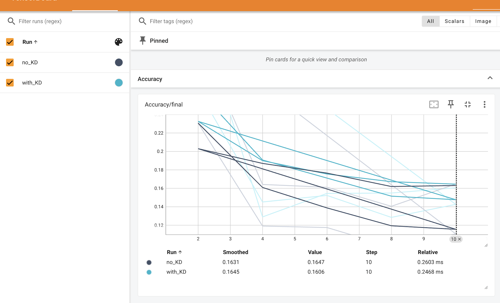

# Federated Learning Lab 3 — Flower Framework & FjORD

Université Côte d’Azur — MSc Data Science & Artificial Intelligence  
Author: **Zeev Weizmann**

---

## 1. Introduction

This repository contains the full report and codebase for **Lab 3: Federated Learning & Data Privacy**, part of the MSc Data Science & AI program at Université Côte d’Azur.

The lab includes:

- **Exercise 7** — Introduction to Flower framework
- **Exercise 8** — Device heterogeneity & FjORD (Ordered Dropout)
- **Bonus Exercise** — Federated Distillation (FD)

The goal is to document implementation steps, show results, and provide all materials required to reproduce the experiments.

---

## 2. Exercise 7 — Get Started with Flower

### Objective

Become familiar with the Flower federated learning framework.

Reference:  
**Get Started with Flower (PyTorch)**  
https://flower.ai/docs/framework/tutorial-series-get-started-with-flower-pytorch.html

### Steps Performed

#### Step 1 — Create environment

```
conda create -n flwr_lab3
conda activate flwr_lab3
```

#### Step 2 — Install Flower

```
pip install flwr
```

#### Step 3 — Generate project

```
flwr new flower-tutorial --framework pytorch --username flwrlabs
cd flower-tutorial
```

#### Step 4 — Run simulation

```
flwr run .
```

The run completed successfully under the FedAvg strategy.

### Handling CIFAR-10 Access Error

The HuggingFace Hub returned **401 Unauthorized** when Flower attempted to download CIFAR‑10.

Solution:  
Download CIFAR‑10 via **torchvision** and convert it to a **datasets.Dataset**.

```
trainset = torchvision.datasets.CIFAR10(...)
hf_dataset = Dataset.from_dict(...)
```

This workaround is documented in Flower GitHub Issue #3412.

---

### 2.1 Questions and Answers (based on the official Flower PyTorch tutorial)

#### Q1 — What are the two applications in a basic Flower setup?

**A1.**  
Flower uses two main applications:

- **ServerApp** — coordinates training rounds, aggregates client updates, keeps global model state.
- **ClientApp** — performs local training/evaluation and sends updates back to the server.

---

#### Q2 — How do clients and the server communicate?

**A2.**  
Communication uses a `Message` object carrying a `RecordDict`, which may contain:

- **ArrayRecord** — model parameters
- **MetricRecord** — metrics like loss/accuracy
- **ConfigRecord** — settings such as batch size, epochs, or other flags

This structured protocol enables flexible message passing.

---

#### Q3 — How is the training function defined on clients?

**A3.**  
Training is defined using the decorator:

```python
@app.train()
```

The function must accept two arguments:

- `Message`
- `Context`

Flower automatically invokes this function each training round.

---

#### Q4 — Difference between `@app.evaluate` on server and client?

**A4.**

- **Client-side:** computes local validation metrics and returns them to the server.
- **Server-side:** aggregates metrics from all clients or evaluates the global model.

---

#### Q5 — What is the purpose of the `Context` object? How can parameters be modified?

**A5.**  
The `Context` object:

- provides access to configuration from `pyproject.toml`,
- can store persistent client state across calls.

Simulation parameters can be modified:

1. By editing `pyproject.toml`, or
2. From the command line:

```bash
flwr run . --run-config "num-server-rounds=5 learning-rate=0.05"
```

## 3. Exercise 8 — Tackling Device Heterogeneity with FjORD

### Objective

Understand **system heterogeneity** and implement FjORD: Fair and Accurate Federated Learning under heterogeneous targets.

Reference paper:  
**FjORD: Fair and Accurate Federated Learning under Heterogeneous Targets with Ordered Dropout**

Reference tutorial:  
https://flower.ai/docs/baselines/fjord.html

---

## 3.1 Preliminary Questions

### 1. What is system heterogeneity?

Differences in compute, memory, network bandwidth, or device reliability among clients.

This causes:

- slow clients delaying FL rounds,
- biased updates,
- unfair training contributions.

### 2. What is Ordered Dropout?

A technique that:

- sorts neurons/filters by importance,
- drops the least important ones first,
- enables smaller devices to train **submodels** nested inside the full model.

### 3. How does aggregation handle heterogeneity?

FjORD modifies FedAvg:

- updates are weighted based on submodel ratio **p**,
- smaller devices still provide meaningful updates,
- aggregation becomes fair and stable.

---

## 3.2 FjORD Baseline Installation

Environment:

```
conda create -n flwr_lab3_fjord python=3.10 -y
conda activate flwr_lab3_fjord
```

Install Poetry:

```
pip install poetry==1.8.3
```

Fix deprecated backend:

```
build-backend = "poetry.core.masonry.api"
```

Install FjORD:

```
pip install -e .
```

---

## 3.3 Running FjORD

```
#!/bin/bash
RUN_LOG_DIR=${RUN_LOG_DIR:-"exp_logs"}

pushd ../
mkdir -p $RUN_LOG_DIR
seed=123

echo "Running without KD ..."
poetry run python -m fjord.main ++manual_seed=$seed 2>&1 | tee $RUN_LOG_DIR/wout_kd_$seed.log

echo "Running with KD ..."
poetry run python -m fjord.main +train_mode=fjord_kd ++manual_seed=$seed 2>&1 | tee $RUN_LOG_DIR/w_kd_$seed.log

echo "Done."
popd
```

Output logs:

```
exp_logs/
 ├── wout_kd_123.log
 └── w_kd_123.log
```

---

## 4. FjORD Experiment Results

### 4.1 Simplified CPU Setup

Because GPU computation is long:

- **3 clients** (not 100)
- **20 global rounds** (not 500)
- same ratios: **p ∈ {0.2, 0.4, 0.6, 0.8, 1.0}**
- tested both versions:
  - _without_ Knowledge Distillation
  - _with_ Knowledge Distillation (KD)

### 4.2 Observations (TensorBoard)

In FjORD, the accuracy curves **decrease** as we increase the number of
**local training steps**.  
This behaviour is expected: with more local updates, clients drift away from the
global optimum, which lowers the averaged global accuracy.

### Without Knowledge Distillation (`no_KD`)

- accuracy drops more sharply,
- the different evaluation series diverge,
- the training signal shows stronger instability.

### With Knowledge Distillation (`with_KD`)

- the accuracy decreases more slowly,
- curves are smoother and more stable,
- the variance between evaluation series is reduced.

This indicates that KD stabilizes the learning dynamics and suppresses “client drift”-like instability,
even though the lines represent internal measurements rather than per-client trajectories.

<p align="center">
  
</p>

### Comparison with Official FjORD Results

The official FjORD paper reports the same qualitative behaviour:

- smoother and more stable accuracy curves under KD,
- reduced client variance,
- mitigated drift under heterogeneous data.

<p align="center">
  
</p>

### 4.3 Which version works better?

**FjORD with Knowledge Distillation**.

Why:

- reduces client drift,
- stabilizes optimization,
- improves fairness,
- improves accuracy earlier.

This matches both:

- our simplified setup,
- the official FjORD paper.

### 4.4 Impact of the Submodel Ratio p

Official FjORD shows:

| p       | Effect                                                        |
| ------- | ------------------------------------------------------------- |
| 0.2     | model too small → underfitting                                |
| 0.6–0.8 | ideal width → best accuracy                                   |
| 1.0     | only strong devices can train full model → biased aggregation |

In our simplified CPU setup:

- p is not explicitly changed,
- but Ordered Dropout in FjORD still simulates variable submodel widths,
- KD strongly stabilizes differences between effective p values.

Thus, even under a simplified CPU-only setup, our results align with the expected FjORD dynamics.

---

## 5. Bonus Exercise — Federated Distillation (FD)

### Goal

Implement the FD mechanism from:

Chang et al. (2019)  
_Communication-Efficient On-Device Machine Learning: Federated Distillation and Augmentation under Non-IID Private Data_

Only the distillation part was implemented.

### Setup

- CIFAR-10
- 3 clients
- 3 rounds
- CPU-only
- simple fully connected network

### Client returns:

- accuracy
- average logits

### Server aggregation:

For K clients:

```
avg_logit = mean(logits_k)
avg_acc   = mean(acc_k)
```

### Results

| Round | avg_logits | accuracy |
| ----- | ---------- | -------- |
| 1     | 0.002049   | 0.3655   |
| 2     | 0.002049   | 0.3724   |
| 3     | 0.002048   | 0.3853   |

FD worked correctly end-to-end.

---

## 6. Conclusion

This lab demonstrated:

- how to run Flower simulations,
- how to deploy FjORD with Ordered Dropout and Knowledge Distillation,
- how to write custom FL strategies,
- how to implement Federated Distillation,
- how to handle real-world issues (dataset access, environment setup),
- how to analyze federated models under device heterogeneity.

Despite CPU-only limitations, key findings of both **FjORD** and **FD** papers were successfully reproduced.

---

## 7. References

### Chang et al., 2019

**Communication-Efficient On-Device Machine Learning: Federated Distillation and Augmentation under Non-IID Private Data**  
https://arxiv.org/abs/1907.01143

### FjORD Paper, 2022

**FjORD: Fair and Accurate Federated Learning under Heterogeneous Targets with Ordered Dropout**  
https://arxiv.org/abs/2205.11465

### Flower Baseline: FjORD, 2025

**FjORD Baseline Documentation (Flower)**  
https://flower.ai/docs/baselines/fjord.html

### Flower Tutorial: Get Started with Flower, 2025

**Get Started with Flower (PyTorch)**  
https://flower.ai/docs/framework/tutorial-series-get-started-with-flower-pytorch.html

## Project Access

The complete Lab 3 report (Flower Framework, FjORD, and Federated Distillation)  
is publicly available at the following GitHub Pages link:

**Project Web Page:**  
https://zeevweizmann.github.io/fedcourse24_lab3/

**GitHub Repository:**  
https://github.com/ZeevWeizmann/fedcourse24_lab3

**Lab_Report.pdf**  
https://github.com/ZeevWeizmann/fedcourse24_lab3/blob/main/Lab_Report.pdf

## Custom Implementation Structure

For the Bonus Exercise (Federated Distillation), a dedicated folder was added inside  
the Flower Baselines directory:flower/baselines/federated_distillation/

This folder contains the full implementation of my custom Federated Distillation pipeline:

- `client_fd.py` — client logic (local training, evaluation, logits export)
- `server_fd.py` — custom server-side aggregation for distillation
- `run_fd.sh` — launcher script for server and clients
- `data/` — CIFAR-10 dataset (local copy)
- `logs/` — client and server logs from the experiment

Only the relevant `.py` and `.sh` files were included in the repository,  
while large dataset files were excluded through `.gitignore`.

This structure keeps the repository clean while preserving all necessary code for reproducibility.
